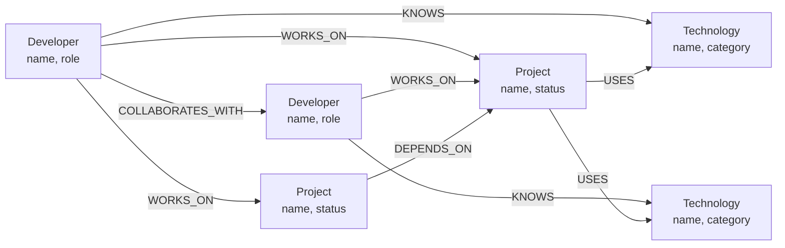

# Cognodb Graph Explorer

> A focused, interactive graph exploration experience backed by
> **CognoDB**, using the official **Neo4j driver**, **openCypher**, and
> **Bolt**.

```{=html}
<p align="center">
```
`<strong>`{=html}Explore developers, projects, technologies, and the
relationships between them.`</strong>`{=html}
```{=html}
</p>
```
```{=html}
<p align="center">
```
`<a href="#overview">`{=html}Overview`</a>`{=html} ·
`<a href="#why-a-graph-database">`{=html}Why Graph?`</a>`{=html} ·
`<a href="#architecture">`{=html}Architecture`</a>`{=html} ·
`<a href="#getting-started">`{=html}Getting Started`</a>`{=html} ·
`<a href="#graph-model">`{=html}Graph Model`</a>`{=html} ·
`<a href="#deployment">`{=html}Deployment`</a>`{=html}
```{=html}
</p>
```

------------------------------------------------------------------------

## Overview

**Cognodb Graph Explorer** is a small full-stack application designed to
make graph relationships understandable to non-technical users.

Instead of presenting developers, projects, and technologies as isolated
records, the application treats them as connected graph entities and
lets users traverse those relationships visually.

### Core experience

1.  Select a developer.
2.  Traverse their connected projects, technologies, and collaborators.
3.  Inspect relationships directly on the graph.
4.  Drag nodes to improve readability.
5.  Pan and zoom the canvas.
6.  Focus any node to inspect its details.
7.  Navigate between connected entities from the detail panel.

The application is intentionally scoped around the graph-native problem
rather than adding unrelated features.

------------------------------------------------------------------------

## Product Preview

> Add the final production screenshots to `docs/images/` before
> submission.

### Graph Explorer


### Focused Node + Detail Panel


### Mobile Layout


------------------------------------------------------------------------

## Why a Graph Database?

The core data is relationship-heavy.

A developer can:

-   work on multiple projects,
-   know multiple technologies,
-   collaborate with other developers,
-   contribute to projects that depend on other projects,
-   and indirectly connect to technologies through those projects.

Representing these connections as a graph makes traversal a first-class
operation.

For example:

``` text
Developer
   │
   ├── WORKS_ON ──> Project
   │                   │
   │                   └── USES ──> Technology
   │
   ├── KNOWS ──────> Technology
   │
   └── COLLABORATES_WITH ──> Developer
```

This becomes particularly useful when the application needs to answer
questions such as:

> "Starting from this developer, what projects, technologies, and
> collaborators are reachable through the graph?"

That is naturally expressed as graph traversal rather than a chain of
relational joins.

------------------------------------------------------------------------

## Graph Model

The application uses three primary node labels:

  Node           Important properties
  -------------- --------------------------
  `Developer`    `id`, `name`, `role`
  `Project`      `id`, `name`, `status`
  `Technology`   `id`, `name`, `category`

### Relationships

  --------------------------------------------------------------------------
  Relationship            Direction                  Meaning
  ----------------------- -------------------------- -----------------------
  `WORKS_ON`              `Developer → Project`      Developer works on a
                                                     project

  `USES`                  `Project → Technology`     Project uses a
                                                     technology

  `KNOWS`                 `Developer → Technology`   Developer knows a
                                                     technology

  `COLLABORATES_WITH`     `Developer ↔ Developer`    Developers collaborate

  `DEPENDS_ON`            `Project → Project`        Project depends on
                                                     another project
  --------------------------------------------------------------------------

### Diagram



The graph is deliberately small enough to run comfortably on CognoDB's
free tier while still demonstrating meaningful traversal.

------------------------------------------------------------------------

## Architecture

``` text
┌──────────────────────────────────────────────────────────────┐
│                        Browser / Client                      │
│                                                              │
│  React + Vite                                                │
│  ├── Graph Explorer UI                                       │
│  ├── Interactive SVG graph                                   │
│  ├── Node focus / drag / pan / zoom                          │
│  ├── Detail panel                                             │
│  └── Light / Dark theme                                      │
└────────────────────────────┬─────────────────────────────────┘
                             │ HTTP / JSON
                             ▼
┌──────────────────────────────────────────────────────────────┐
│                         Backend API                          │
│                                                              │
│  Express                                                     │
│  ├── Graph routes                                            │
│  ├── Controllers / services                                  │
│  └── Parameterized openCypher queries                        │
└────────────────────────────┬─────────────────────────────────┘
                             │ Official Neo4j Driver / Bolt
                             ▼
┌──────────────────────────────────────────────────────────────┐
│                           CognoDB                             │
│                                                              │
│  Graph nodes + typed relationships + properties              │
└──────────────────────────────────────────────────────────────┘
```

### Design principles

-   **Graph-first:** relationships are part of the product experience.
-   **Simple architecture:** each layer has a clear responsibility.
-   **Parameterized queries:** user-controlled values are never
    concatenated into Cypher.
-   **Explainable code:** the implementation is intentionally
    straightforward enough to discuss line-by-line.
-   **Graceful failure:** database connectivity failures are surfaced as
    application states rather than raw crashes.

------------------------------------------------------------------------

## Technology Stack

### Frontend

-   React
-   Vite
-   Tailwind CSS
-   Framer Motion
-   Lucide Icons
-   SVG / `foreignObject` for interactive graph nodes

### Backend

-   Node.js
-   Express
-   Official Neo4j JavaScript driver
-   openCypher
-   Bolt

### Database

-   CognoDB

------------------------------------------------------------------------

## Repository Structure

``` text
cognodb-graph-explorer/
├── client/
│   ├── src/
│   │   ├── components/
│   │   │   ├── developer/
│   │   │   ├── graph/
│   │   │   └── layout/
│   │   ├── pages/
│   │   └── index.css
│   └── package.json
│
├── server/
│   ├── controllers/
│   ├── routes/
│   ├── services/
│   ├── models/
│   ├── scripts/
│   └── package.json
│
├── docs/
│   └── images/
│
├── .env.example
└── README.md
```

> Adjust the tree above if the final repository structure differs. The
> README should describe the repository as it exists in the submitted
> commit.

------------------------------------------------------------------------

# Getting Started

## Prerequisites

Install:

-   Node.js 18+ recommended
-   npm
-   A CognoDB instance
-   Git

Verify Node and npm:

``` bash
node --version
npm --version
```

------------------------------------------------------------------------

## 1. Clone the repository

``` bash
git clone <YOUR_REPOSITORY_URL>
cd cognodb-graph-explorer
```

------------------------------------------------------------------------

## 2. Configure CognoDB

Create a CognoDB instance and obtain the connection credentials required
by the application.

The backend should read database configuration from environment
variables.

Create the server environment file:

``` bash
cp server/.env.example server/.env
```

Example:

``` env
COGNODB_URI=<your-cognodb-bolt-uri>
COGNODB_USERNAME=<your-username>
COGNODB_PASSWORD=<your-password>
PORT=5001
```

Do **not** commit real credentials.

------------------------------------------------------------------------

## 3. Install dependencies

Install backend dependencies:

``` bash
cd server
npm install
```

Install frontend dependencies:

``` bash
cd ../client
npm install
```

------------------------------------------------------------------------

## 4. Seed the graph

From the server directory, run the repository's seed/data-loading
script:

``` bash
npm run seed
```

The seed process creates the small demonstration graph used by the
application.

------------------------------------------------------------------------

## 5. Start the backend

``` bash
cd server
npm run dev
```

The API should become available on the configured port, for example:

``` text
http://localhost:5001
```

A health endpoint should be available for basic connectivity
verification.

------------------------------------------------------------------------

## 6. Start the frontend

In a second terminal:

``` bash
cd client
npm run dev
```

Open the local Vite URL shown by the terminal.

------------------------------------------------------------------------

# API

The frontend communicates with the backend through JSON APIs.

The graph traversal endpoints used by the application include:

``` text
GET /api/graph/developers
GET /api/graph/traverse/:developerId
```

Example:

``` bash
curl http://localhost:5001/api/graph/developers
```

Traversal:

``` bash
curl http://localhost:5001/api/graph/traverse/dev-3
```

Example response shape:

``` json
{
  "success": true,
  "data": {
    "nodes": [],
    "relationships": []
  }
}
```

The actual graph payload contains labeled nodes and typed relationships
that the client converts into the interactive graph.

------------------------------------------------------------------------

# Main Graph Queries

The application demonstrates both direct relationship queries and
multi-hop traversal.

## Developer → Projects

Conceptually:

``` cypher
MATCH (d:Developer {id: $developerId})-[r:WORKS_ON]->(p:Project)
RETURN d, r, p
```

The developer ID is supplied as a query parameter.

------------------------------------------------------------------------

## Developer → Technologies

``` cypher
MATCH (d:Developer {id: $developerId})-[r:KNOWS]->(t:Technology)
RETURN d, r, t
```

------------------------------------------------------------------------

## Multi-hop traversal

A graph-native traversal can follow a developer through a project to the
technologies used by that project:

``` cypher
MATCH (d:Developer {id: $developerId})
      -[:WORKS_ON]->(p:Project)
      -[:USES]->(t:Technology)
RETURN d, p, t
```

This is a **2-hop traversal**:

``` text
Developer
   │ WORKS_ON
   ▼
Project
   │ USES
   ▼
Technology
```

The application also exposes collaboration and project dependency
relationships, allowing the graph to represent paths that become
increasingly cumbersome to express as ordinary relational joins.

------------------------------------------------------------------------

# Interactive Graph

The canvas is designed around direct manipulation rather than a static
visualization.

### Node interaction

-   Drag a node to reposition it.
-   Use **Focus** to center a node and enter focused exploration.
-   Click connected nodes from the detail panel.
-   Unrelated nodes remain present but become visually de-emphasized.

### Canvas interaction

-   Drag empty canvas space to pan.
-   Use mouse-wheel / trackpad input to zoom.
-   Pinch gestures are handled as canvas zoom interactions.
-   Zooming follows the pointer or pinch midpoint.
-   Reset restores the graph viewport.

### Visual behavior

-   Curved adaptive relationships.
-   Directional relationship indicators.
-   Relationship labels.
-   Dynamic node sizing.
-   Category tags for `Developer`, `Project`, and `Technology`.
-   Light and dark themes.
-   Responsive desktop/mobile layout.
-   Reduced-motion support.

------------------------------------------------------------------------

# States & Resilience

The application is expected to handle the main user-facing states
explicitly:

  -----------------------------------------------------------------------
  State                               Expected behavior
  ----------------------------------- -----------------------------------
  Loading                             Show a clear loading state while
                                      graph data is requested

  Empty                               Explain that there are no graph
                                      records available

  Error                               Show a useful failure state rather
                                      than exposing raw backend errors

  Database unavailable                Backend failure is surfaced
                                      gracefully to the client

  Focused                             Related graph elements remain
                                      visible while unrelated elements
                                      are de-emphasized
  -----------------------------------------------------------------------

------------------------------------------------------------------------

# Security & Configuration

Database credentials belong in environment variables.

Never:

-   commit `.env` files containing secrets,
-   hard-code database passwords,
-   concatenate user input into Cypher queries.

All user-controlled Cypher values should be passed as parameters.

Example:

``` cypher
MATCH (d:Developer {id: $developerId})
RETURN d
```

Not:

``` js
// Do not do this
`MATCH (d:Developer {id: '${developerId}'}) RETURN d`
```

------------------------------------------------------------------------

# Production Build

Before deployment, create a production frontend build:

``` bash
npm run build --prefix client
```

Preview the production build locally:

``` bash
npm run preview --prefix client
```

Before deploying, verify:

-   frontend build succeeds,
-   API responds,
-   CognoDB connection succeeds,
-   seed data is present,
-   graph renders,
-   node focus works,
-   detail panel navigation works,
-   canvas pan/zoom works,
-   Reset View works,
-   light/dark theme works,
-   no secrets are included in the repository.

------------------------------------------------------------------------

# Deployment

The application requires:

``` text
Frontend
   │
   ▼
Hosted Web Application
   │
   │ API requests
   ▼
Hosted Backend
   │
   │ Bolt
   ▼
CognoDB
```

Configure production environment variables on the backend hosting
provider:

``` env
COGNODB_URI=<production-uri>
COGNODB_USERNAME=<production-username>
COGNODB_PASSWORD=<production-password>
PORT=<provider-port>
```

The final hosted demo URL should be added here before submission:

``` text
https://<your-production-demo>
```

Keep the CognoDB instance running after submission as required by the
assignment.

------------------------------------------------------------------------

# Verification Checklist

Before submitting, verify the following.

### Application

-   [ ] App loads successfully.
-   [ ] Developer list loads.
-   [ ] Developer selection traverses the graph.
-   [ ] Nodes render correctly.
-   [ ] Relationships render correctly.
-   [ ] Focus works.
-   [ ] Detail panel works.
-   [ ] Connected-node navigation works.
-   [ ] Node dragging works.
-   [ ] Canvas panning works.
-   [ ] Mouse/trackpad zoom works.
-   [ ] Reset View works.
-   [ ] Light/dark theme works.
-   [ ] Mobile layout works.

### Graph requirements

-   [ ] CognoDB is used.
-   [ ] Official Neo4j driver is used.
-   [ ] Nodes have labels.
-   [ ] Relationships are typed.
-   [ ] Properties are meaningful.
-   [ ] Seed data exists.
-   [ ] Seed script exists.
-   [ ] Cypher queries are included.
-   [ ] At least one 2+ hop traversal exists.
-   [ ] At least one relationally awkward graph query exists.
-   [ ] Cypher is parameterized.

### Security

-   [ ] No credentials committed.
-   [ ] `.env` is ignored.
-   [ ] Production secrets are configured through the host.
-   [ ] User input is never concatenated into Cypher.

### Submission

-   [ ] README completed.
-   [ ] Graph diagram included.
-   [ ] Screenshots included.
-   [ ] Production demo tested.
-   [ ] Short screen recording completed.
-   [ ] GitHub repository reviewed.
-   [ ] Demo URL reviewed.
-   [ ] Submission email prepared.

------------------------------------------------------------------------

# Screenshots & Documentation Assets

Recommended repository layout:

``` text
docs/
└── images/
    ├── graph-explorer.png
    ├── detail-panel.png
    └── mobile.png
```

Use screenshots from the final deployed build rather than
development-only screenshots.

------------------------------------------------------------------------

# Design Direction

The interface follows a restrained, product-oriented visual direction:

-   minimal information hierarchy,
-   intentional spacing,
-   restrained color usage,
-   high-contrast graph elements,
-   subtle motion,
-   direct manipulation,
-   responsive layouts,
-   accessible controls,
-   no unnecessary dashboard clutter.

The graph is the primary product surface; surrounding UI exists to help
users understand and navigate it.

------------------------------------------------------------------------

# Assignment Context

This project was built as a Wexa AI take-home assignment requiring a
complete application backed by CognoDB.

The implementation focuses on demonstrating:

1.  meaningful graph modeling,
2.  relationship-based querying,
3.  a usable graph exploration experience,
4.  safe database integration,
5.  a complete end-to-end application.

The assignment also requires a hosted demo, repository submission, and
short screen recording.

------------------------------------------------------------------------

## License

This repository was created for the assignment and demonstration
purposes.

------------------------------------------------------------------------

```{=html}
<p align="center">
```
Built around relationships, not rows.
```{=html}
</p>
```
