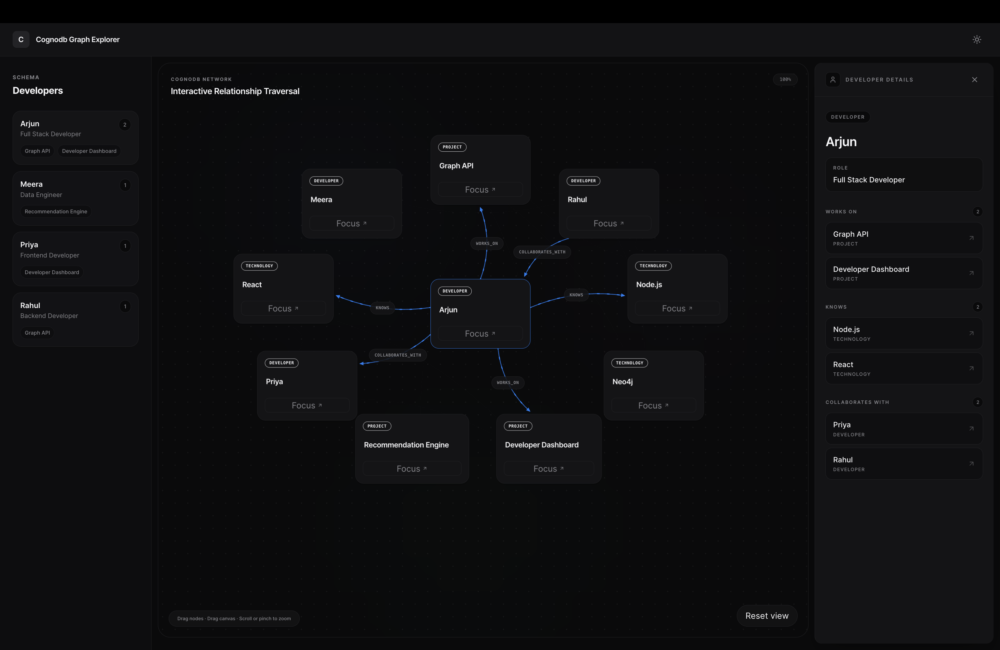
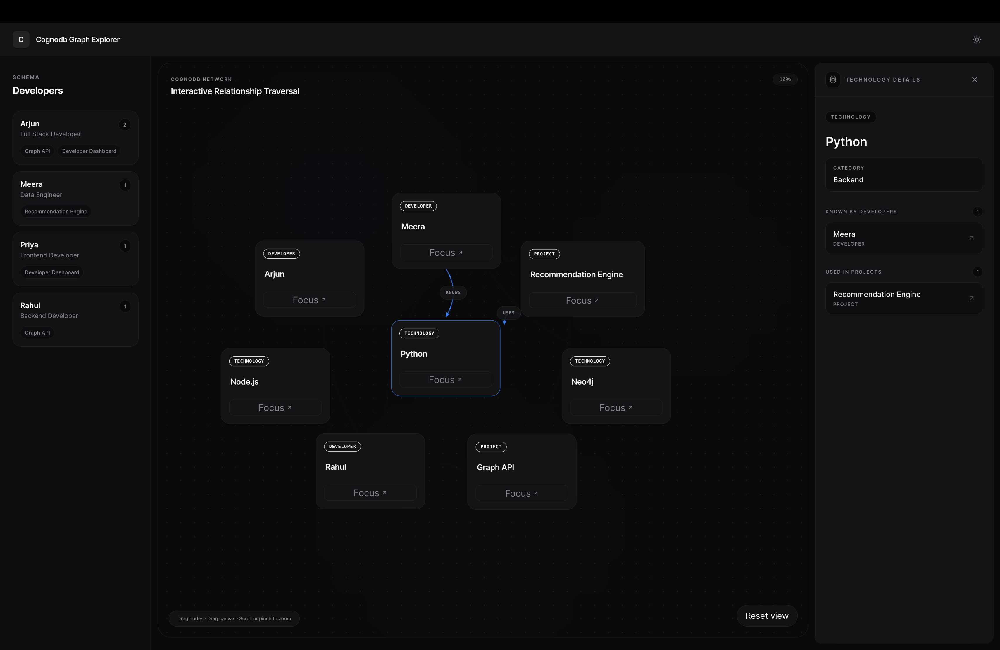
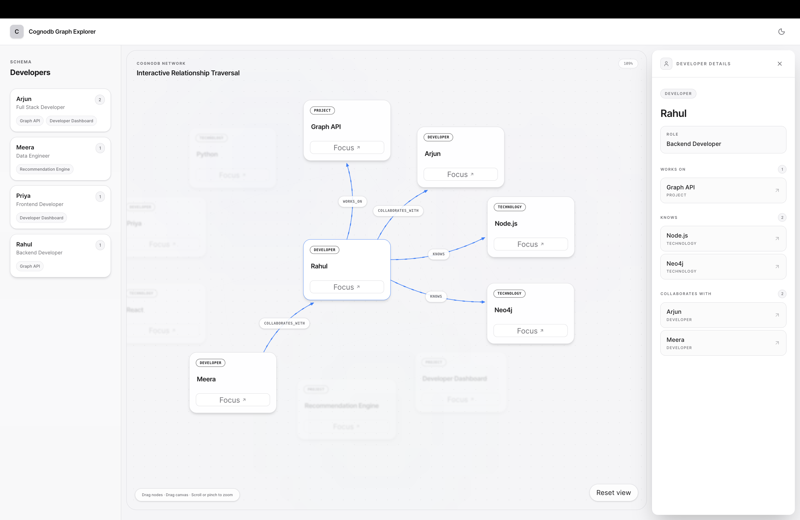
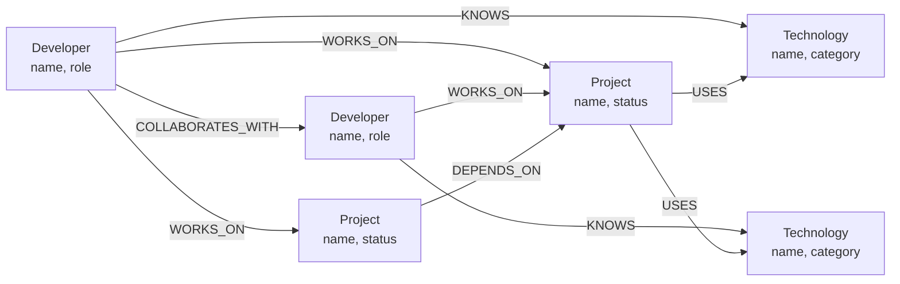

# Cognodb Graph Explorer

**An interactive graph exploration app for developers, projects, and technologies — built on CognoDB with the official Neo4j driver, openCypher, and Bolt.**


[Overview](#overview) · [Why Graph](#why-a-graph-database) · [Architecture](#architecture) · [Getting Started](#getting-started) · [Graph Model](#graph-model) · [Deployment](#deployment)

---

## Overview

**Cognodb Graph Explorer** turns relationship-heavy data — developers, projects, and technologies — into something you can actually *see* and *traverse*, instead of scanning flat tables.

Pick a developer, follow their connections outward, and inspect every relationship along the way — on a canvas you can drag, pan, zoom, and reset.

---

### Video Link
Check out the [Live Demo]([https://example.com]) of this project.

---
### Core experience

1. Select a developer
2. Traverse their projects, technologies, and collaborators
3. Inspect relationships directly on the graph
4. Drag nodes, pan the canvas, zoom in and out
5. Focus a node to de-emphasize everything unrelated
6. Jump between connected entities from the detail panel


## Screeshots
<p align="center">
  
</p>
<p align="center">
  
</p>
<p align="center">
  
</p>

---

## Why a Graph Database?

The underlying data is inherently relational *and* deeply interconnected. A developer can:

- work on multiple projects
- know multiple technologies
- collaborate with other developers
- contribute to projects that depend on other projects
- connect indirectly to technologies through those projects

```
Developer
   │
   ├── WORKS_ON ─────────► Project
   │                          │
   │                          └── USES ─────► Technology
   │
   ├── KNOWS ────────────► Technology
   │
   └── COLLABORATES_WITH ─► Developer
```


---

## Architecture

```
┌───────────────────────────────────────────┐
│              Browser / Client             │
│  React + Vite                             │
│  • Interactive SVG graph canvas           │
│  • Node focus / drag / pan / zoom         │
│  • Detail panel                           │
│  • Light / dark theme                     │
└─────────────────┬─────────────────────────┘
                  │ HTTP / JSON
                  ▼
┌───────────────────────────────────────────┐
│                Backend API                │
│  Express                                  │
│  • Graph routes + controllers/services    │
│  • Parameterized openCypher queries       │
└─────────────────┬─────────────────────────┘
                  │ Official Neo4j Driver / Bolt
                  ▼
┌───────────────────────────────────────────┐
│                 CognoDB                   │
│  Graph nodes + typed relationships        │
└───────────────────────────────────────────┘
```

**Design principles**

| Principle | What it means here |
|---|---|
| Graph-first | Relationships are part of the product experience, not an implementation detail |
| Simple architecture | Each layer has one clear responsibility |
| Parameterized queries | User input is never concatenated into Cypher |
| Explainable code | Simple enough to walk through line-by-line |
| Graceful failure | DB connectivity issues surface as app states, not raw crashes |

---

## Tech Stack

| Layer | Stack |
|---|---|
| **Frontend** | React · Vite · Tailwind CSS · Framer Motion · Lucide Icons · SVG (`foreignObject` for interactive nodes) |
| **Backend** | Node.js · Express · Official Neo4j JS Driver · openCypher · Bolt |
| **Database** | CognoDB |

---

## Graph Model

**Nodes**

| Node | Key properties |
|---|---|
| `Developer` | `id`, `name`, `role` |
| `Project` | `id`, `name`, `status` |
| `Technology` | `id`, `name`, `category` |

**Relationships**

| Relationship | Direction | Meaning |
|---|---|---|
| `WORKS_ON` | `Developer → Project` | Developer works on a project |
| `USES` | `Project → Technology` | Project uses a technology |
| `KNOWS` | `Developer → Technology` | Developer knows a technology |
| `COLLABORATES_WITH` | `Developer ↔ Developer` | Developers collaborate |
| `DEPENDS_ON` | `Project → Project` | Project depends on another project |



The graph is intentionally small — enough to fit CognoDB's free tier while still demonstrating meaningful, multi-hop traversal.

---

## Getting Started

### Prerequisites

- Node.js 18+
- npm
- A CognoDB instance
- Git

```bash
node -- v22.20.0
npm -- 10.9.3
```

### 1. Clone

```bash
git clone https://github.com/prasxor/cognodb-graph-explorer
cd cognodb-graph-explorer
```

### 2. Configure CognoDB

```bash
cp server/.env.example server/.env
```

```env
COGNODB_URI=<your-cognodb-bolt-uri>
COGNODB_USERNAME=<your-username>
COGNODB_PASSWORD=<your-password>
PORT=5001
```


### 3. Install dependencies

```bash
cd server && npm install
cd ../client && npm install
```

### 4. Seed the graph

```bash
cd server
npm run seed
```

### 5. Run the backend

```bash
npm run dev
# → http://localhost:5001
```

A health endpoint is available for basic connectivity checks.

### 6. Run the frontend

```bash
cd client
npm run dev
```

Open the local Vite URL printed in the terminal.

---

## API Reference

| Method | Endpoint | Description |
|---|---|---|
| `GET` | `/api/graph/developers` | List all developers |
| `GET` | `/api/graph/traverse/:developerId` | Traverse a developer's connected graph |

```bash
curl http://localhost:5001/api/graph/developers
curl http://localhost:5001/api/graph/traverse/dev-3
```

**Response shape**

```json
{
  "success": true,
  "data": {
    "nodes": [],
    "relationships": []
  }
}
```

---

## Example Cypher Queries

**Developer → Projects**
```cypher
MATCH (d:Developer {id: $developerId})-[r:WORKS_ON]->(p:Project)
RETURN d, r, p
```

**Developer → Technologies**
```cypher
MATCH (d:Developer {id: $developerId})-[r:KNOWS]->(t:Technology)
RETURN d, r, t
```

**Multi-hop traversal** (Developer → Project → Technology)
```cypher
MATCH (d:Developer {id: $developerId})
      -[:WORKS_ON]->(p:Project)
      -[:USES]->(t:Technology)
RETURN d, p, t
```

The app also exposes collaboration (`COLLABORATES_WITH`) and project dependency (`DEPENDS_ON`) queries — the kind of paths that get increasingly awkward to express as relational joins but stay natural in Cypher.

---

## Interactive Graph

**Node interaction**
- Drag to reposition
- Focus to center and enter focused exploration
- Navigate via connected nodes in the detail panel
- Unrelated nodes stay visible but de-emphasized

**Canvas interaction**
- Drag empty space to pan
- Scroll / pinch to zoom, anchored to pointer or pinch midpoint
- Reset restores the default viewport

**Visual details**
- Curved, adaptive relationship lines with directional indicators and labels
- Dynamic node sizing and category tags per node type
- Light/dark themes, responsive layout, reduced-motion support

---

## States & Resilience

| State | Behavior |
|---|---|
| Loading | Clear loading indicator while graph data is fetched |
| Empty | Explicit message when no graph records exist |
| Error | User-facing failure message, no raw backend errors exposed |
| DB unavailable | Backend failure surfaced gracefully to the client |
| Focused | Related elements stay visible; unrelated elements fade |

---

## Security

- Credentials live in environment variables — never hard-coded
- `.env` is git-ignored
- All user-controlled values are passed as Cypher parameters, never concatenated

```cypher
-- Correct
MATCH (d:Developer {id: $developerId}) RETURN d
```
```js
// Never do this
`MATCH (d:Developer {id: '${developerId}'}) RETURN d`
```

---

## Deployment

```
Frontend → Hosted Web App → API requests → Hosted Backend → Bolt → CognoDB
```

**Production build**

```bash
npm run build --prefix client
npm run preview --prefix client
```

**Production environment variables** (set on the backend host)

```env
COGNODB_URI=<production-uri>
COGNODB_USERNAME=<production-username>
COGNODB_PASSWORD=<production-password>
PORT=<provider-port>
```

**Live demo:** `https://<your-production-demo>` — add before submission
Keep the CognoDB instance running after submission.

---

## Pre-submission Checklist

**Application**
- [x] App loads · Developer list loads · Selection traverses the graph
- [x] Nodes and relationships render correctly
- [x] Focus, detail panel, and connected-node navigation work
- [x] Drag, pan, zoom, and Reset View work
- [x] Light/dark theme and mobile layout work

**Graph requirements**
- [x] CognoDB + official Neo4j driver in use
- [x] Labeled nodes, typed relationships, meaningful properties
- [x] Seed data + seed script present
- [x] At least one 2+ hop traversal and one relationally-awkward query
- [x] All Cypher is parameterized

**Security**
- [x] No committed credentials · `.env` ignored · secrets set via host

**Submission**
- [x] README, diagrams, and screenshots complete
- [x] Production demo tested · screen recording done
- [x] Repository and demo URL reviewed

---

## Repository Structure

```
cognodb-graph-explorer/
├── client/
│   └── src/
│       ├── components/{developer,graph,layout}/
│       ├── pages/
│       └── index.css
├── server/
│   ├── controllers/ · routes/ · services/ · models/ · scripts/
│   └── package.json
├── docs/images/
├── .env.example
└── README.md
```

---

## Design Direction

Minimal information hierarchy, intentional spacing, restrained color, high-contrast graph elements, subtle motion, direct manipulation, accessible controls — no dashboard clutter. The graph is the product; the UI exists to help you read it.

---

## Project Context

Built as a Wexa AI take-home assignment: a complete graph-backed application demonstrating meaningful modeling, relationship-based querying, safe database integration, and a usable end-to-end exploration experience.

---

**Built around relationships, not rows.**
